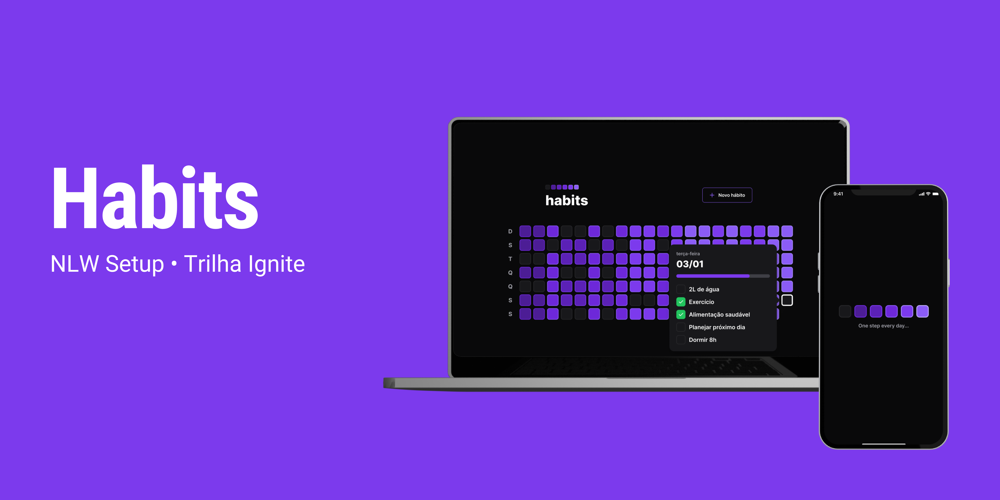
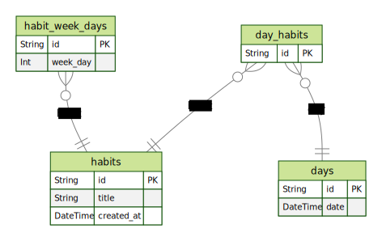

<p align='center'>
  
  
  
</p>

<h1 align="center" style='font-size: 4rem; font-weight: bold;'>Habits - Server</h1>

<h2>🖥️ Tecnologias</h2>

O server da aplicação foi desenvolvido com as seguintes tecnologias:

- TypeScript
- Node.js
- [Fastify](https://www.fastify.io)
- [Zod](https://github.com/colinhacks/zod)
- [Prisma](https://www.prisma.io)
- SQLite

<h2>📄 Lógica do Banco de dados gerado pelo Prisma</h2>

Após criar as tabelas com suas relações e gerar as migrations conseguimos gerar um diagrama, o da aplicação em questão está exemplado abaixo:



<h2>🚀 Como rodar o server</h2>

Rode no terminal para instalar as dependências, que pode ver no ```package.json```:

```bash
$ yarn
```
or
```bash
$ npm install
```

Rode no terminal para iniciar a aplicação:
```bash
$ yarn dev
```
or
```bash
$ npm dev
```

<h2>🪄 Rotas</h2>

Rotas desenvolvidas na aplicação:

- ### Resumo dos hábitos cadastrados e completados ao longo dos dias de uso da aplicação:
```bash
$ GET /summary
```
Exemplo de resposta do aplicação:
```json
[
	{
		"id": "16ee73b6-7470-4cdb-87ca-01fbd93db691",
		"date": "2023-01-06T03:00:00.000Z",
		"completed": 1,
		"amount": 1
	},
	{
		"id": "226b988f-f1a2-4d4f-864a-a0229c69ceb5",
		"date": "2023-01-02T03:00:00.000Z",
		"completed": 1,
		"amount": 1
	},
	{
		"id": "8aa90fc9-60df-4d0c-904a-00d33361c14b",
		"date": "2023-01-04T03:00:00.000Z",
		"completed": 2,
		"amount": 2
	},
	{
		"id": "e625b788-af2c-42b9-a12d-631ff1038d74",
		"date": "2023-01-20T03:00:00.000Z",
		"completed": 1,
		"amount": 2
	}
]
```

| Campo    | Tipo       | Descrição                                                          |
| -------- | ---------  | ------------------------------------------------------------------ |
| id       | `string`   | id gerado automaticamente no formato do UUID                       |
| date     | `string`   | date adquirida pela aplicação no formato ```YYYY-MM-DDTH```        |
| completed| `number`   | número de hábitos completados deste dia específico                 |
| amount   | `number`   | número de hábitos cadastrados deste dia específico                 |


- ### Cadastrar novo hábito:
```bash
$ POST /habits
```
Exemplo de body em ```json```:
```json
{
  "title": "Fazer exercício",
  "weekDays": [0,1,2,3]
}
```
| Campo    | Tipo       | Descrição                                                          |
| -------- | ---------  | ------------------------------------------------------------------ |
| title    | `string`   | Título do hábito cadastrar                                         |
| weekDays | `number[]` | Recorrência do hábito, onde os números represantam um dia, começando pelo 0 - Domingo|

- ### Consultar hábitos de um dia específico:
```
GET /day?date={date}
```
Exemplo de resposta do aplicação:
```json
{
	"possibleHabits": [
		{
			"id": "40b172b7-70fe-439c-988a-0fe7b1cce95b",
			"title": "tomar banho",
			"created_at": "2023-01-21T03:00:00.000Z"
		},
		{
			"id": "4e420af6-2d3b-4ba7-a30d-8fddfacc120a",
			"title": "Tomar Vitamina D",
			"created_at": "2023-01-21T03:00:00.000Z"
		}
	],
	"completedHabits": []
}
```

| Campo    | Tipo       | Descrição                        |
| -------- | ---------  | -------------------------------- |
| date     | `string`   | Data do dia requisitado, no formato ```YYYY-MM-DDTH``` |


- ### Mudar status do hábito:
```
PATCH /habits/{id}/toggle
```
| Campo    | Tipo       | Descrição                                 |
| -------- | ---------  | ----------------------------------------- |
| id       | `string`   | ID do hábito que entrará no array de ```completedHabits``` |

---
# 👩‍🚀 Autora

<a href="https://app.rocketseat.com.br/me/m-raquel">
 
 <br />
 <sub><b>Maria Raquel</b></sub></a> <a href="https://app.rocketseat.com.br/me/m-raquel" title="Rocketseat"></a>

Feito com ❤️ por Maria Raquel (com as aulas da Rocketseat) 👋🏽 Entre em contato!

 [](https://www.linkedin.com/in/maria-raquel-3b27531a5/) [](mailto:raquelquequel20@gmail.com) [](mailto:M-Raquel@outlook.com)