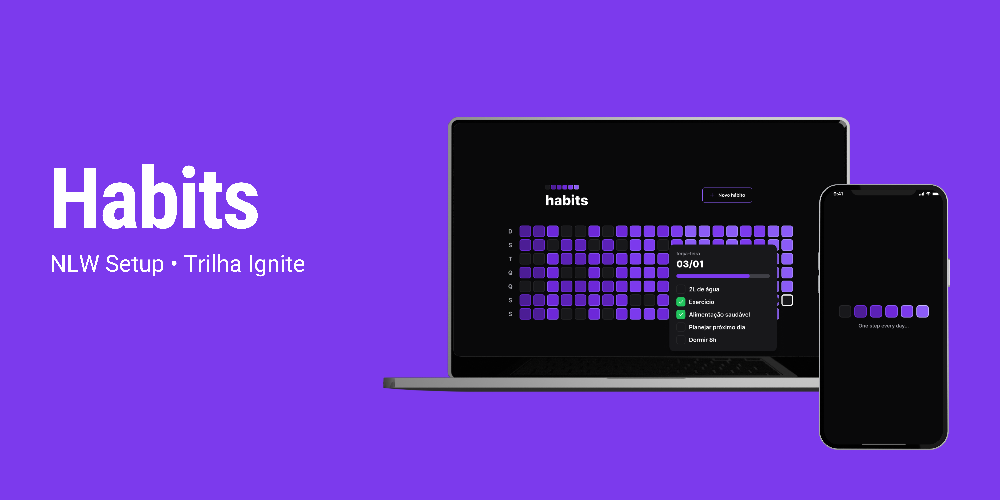
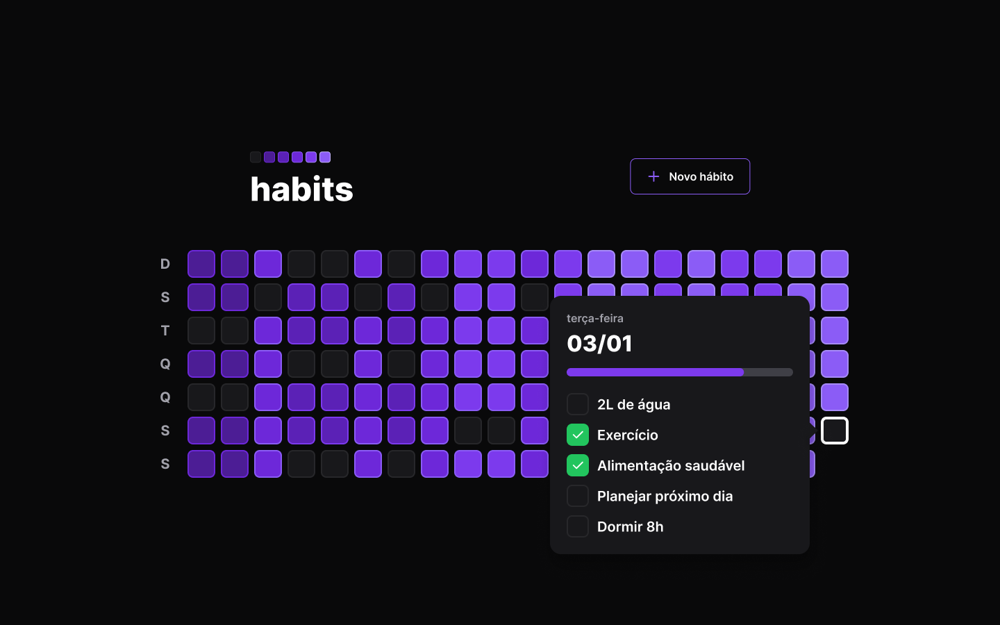

<p align='center'>
  
  
  
</p>

<h1 align="center" style='font-size: 4rem; font-weight: bold;'>Habits - Web</h1>

<h2>🖥️ Tecnologias</h2>

O server da aplicação foi desenvolvido com as seguintes tecnologias:

- Typescript
- [Vite](https://vitejs.dev)
- [TailwindCSS](https://tailwindcss.com)
- [Toastify](https://fkhadra.github.io/react-toastify/introduction)
- [Dayjs](https://day.js.org)

<h2>🚀 Como rodar o web</h2>

Rode no terminal para instalar as dependências, que pode ver no ```package.json```:

```bash
$ yarn
```
or
```bash
$ npm install
```

Rode no terminal para iniciar a aplicação:
```bash
$ yarn dev
```
or
```bash
$ npm dev
```
<h2>🖼️ Demonstração</h2>



---
# 👩‍🚀 Autora

<a href="https://app.rocketseat.com.br/me/m-raquel">
 
 <br />
 <sub><b>Maria Raquel</b></sub></a> <a href="https://app.rocketseat.com.br/me/m-raquel" title="Rocketseat"></a>

Feito com ❤️ por Maria Raquel (com as aulas da Rocketseat) 👋🏽 Entre em contato!

 [](https://www.linkedin.com/in/maria-raquel-3b27531a5/) [](mailto:raquelquequel20@gmail.com) [](mailto:M-Raquel@outlook.com)